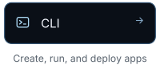
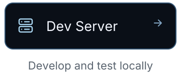

The all-in-one cloud with frontend, backend, data, security, and observability working as one.

Fluxzero is a cloud platform for applications built with AI. It hosts your frontend and backend, stores your data, and runs the application in production. Unlike other clouds, Fluxzero gives every product a reliable backend, so your agent can focus on the product instead of its tech stack.

<strong>Build with us.</strong> Builders and coding agents are welcome to share ideas, report issues, and contribute pull requests.

  <a href="https://github.com/fluxzero-io/fluxzero-sdk-java"><picture><source media="(prefers-color-scheme: dark)" srcset="assets/brand/2026-09/profile/sdk-dark.svg"></picture></a>
  <a href="https://github.com/fluxzero-io/fluxzero-agent-plugins"><picture><source media="(prefers-color-scheme: dark)" srcset="assets/brand/2026-09/profile/agents-dark.svg"></picture></a>
  <a href="https://github.com/fluxzero-io/fluxzero-cli"><picture><source media="(prefers-color-scheme: dark)" srcset="assets/brand/2026-09/profile/cli-dark.svg"></picture></a>
  <a href="https://github.com/fluxzero-io/fluxzero-dev-server"><picture><source media="(prefers-color-scheme: dark)" srcset="assets/brand/2026-09/profile/dev-server-dark.svg"></picture></a>

  <a href="https://fluxzero.io/get-started"><strong>Get started →</strong></a> &nbsp;·&nbsp;
  <a href="https://fluxzero.io/docs">Docs</a> &nbsp;·&nbsp;
  <a href="https://fluxzero.io/contact">Talk to us</a>

About this repository

This repository contains the [public organization profile](profile/README.md) and [GitHub brand assets](assets/brand/README.md).

Fluxzero logos and branding are all rights reserved. Each project defines its own software license.

